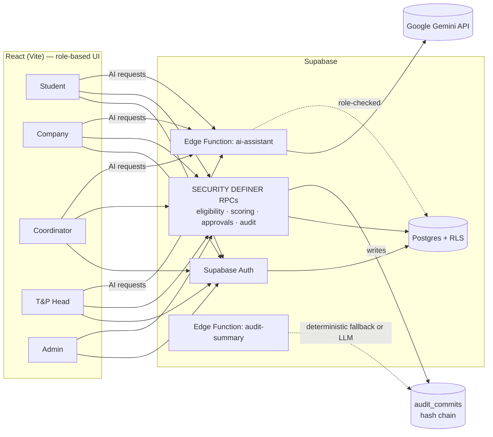

# PlaceGuard

**AI-assisted campus placement governance — every eligibility check, score, and shortlist decision is enforced server-side and permanently auditable.**

Campus recruitment usually runs on spreadsheets, email threads, and manual shortlist edits — which makes it hard to prove *why* a candidate was accepted or rejected, easy for eligibility rules to be bent after the fact, and almost impossible to audit after a drive closes. PlaceGuard is a placement-governance platform that turns each step of the recruitment lifecycle — drive creation, eligibility checking, timed assessments, round-by-round evaluation, shortlisting, and final selection — into a server-verified, permission-checked, and permanently logged action.

PlaceGuard is built for five roles: **students** applying to drives and taking assessments, **companies** running recruitment drives and evaluating candidates, **placement coordinators** proposing shortlist changes, the **T&P Head** approving them under a strict separation-of-duties rule, and **admins** managing accounts under an access-request workflow. What sets PlaceGuard apart is its trust model: the frontend never makes an eligibility, scoring, authorization, or approval decision — every one of those is executed inside PostgreSQL `SECURITY DEFINER` functions on Supabase, validated against `auth.uid()`, server time, and role, and recorded as a cryptographically hash-chained, append-only audit event. Google Gemini is layered on top as an **advisory** assistant — generating draft questions, recruitment plans, and candidate/drive summaries — never as a system of record.

## Key Features

### Student
- Browse open drives and apply; eligibility (CGPA, backlogs, branch, required skills) is (re-)checked server-side at the moment of application, not just displayed client-side
- Timed, auto-scored MCQ assessments with a question navigator, answer flagging, and automatic submission on timeout
- Per-round results and scorecards, plus a consolidated results view across all applications
- Round-by-round progress tracking as a drive moves through its recruitment pipeline
- AI-generated performance analysis of their own assessment results (strengths, weak areas, prep suggestions)
- A dedicated coding-round screen exists in the UI and database schema (problem panel, language selector, code editor, `coding_problems` / `coding_submissions` tables), but live code execution is **intentionally disabled** pending a Judge0 integration — the app shows an explicit "not configured" message rather than a fake result

### Company
- Create recruitment drives with structured eligibility rules (min CGPA, max backlogs, allowed branches, required skills) and publish them
- Build a multi-round recruitment pipeline per drive (aptitude, coding, SQL, Linux, cloud, technical interview, HR interview, group discussion, and more)
- Author assessments per round: create the assessment, add/remove questions, and maintain a reusable company question bank
- Evaluate rounds and advance or reject candidates, with a dedicated evaluation modal per round
- View all candidates for a drive alongside their application and eligibility status
- Per-drive recruitment funnel and assessment analytics, plus company-wide recruitment metrics (drives, applications, shortlisted, selected, rejected)
- AI-assisted MCQ and interview question generation, and AI-drafted full recruitment-process plans (eligibility + round structure) for a role

### T&P / Governance
- Shortlist changes go through a proposal → approval workflow: coordinators propose additions/removals with a reason, and only the T&P Head can approve — a proposer can never approve their own proposal (enforced both in shared domain logic and in the database function)
- Sensitive admin actions go through a change-request workflow requiring T&P Head sign-off
- Role-based permissions enforced at two layers: Postgres Row Level Security policies and `SECURITY DEFINER` RPCs that re-validate the caller's role server-side
- Append-only, tamper-evident audit trail: every state-changing action is recorded as a SHA-256 hash-chained commit and can be verified on demand via a `verify_audit_chain()` check that flags the exact point of any inconsistency (this is explicitly a hash chain, not a blockchain)
- Rule-based anomaly detection that scores and flags late actions, eligibility violations, unauthorized actions, branch-rule violations, and repeated modification attempts
- Placement-wide analytics for T&P and coordinators: registered vs. placed students, placement percentage, offers accepted/pending, and breakdowns by role and branch

### AI (Google Gemini)
- All AI features are routed through a single authenticated Supabase Edge Function that calls Gemini server-side — the API key is never exposed to the browser, and every request is checked against the caller's role before Gemini is called
- **Question generation** — draft MCQ questions for a role/topic/difficulty, saved as drafts for human review and explicit approval before they can be added to a live assessment
- **Recruitment plan generation** — a suggested eligibility rule set plus a structured multi-round process for a given job role
- **Candidate analysis** — an advisory read of a candidate's multi-round performance (strongest/weakest areas, hiring signal), generated only from real submitted results and always carrying a disclaimer that it does not override official decisions
- **Company recruitment summaries** — a funnel and analytics narrative for a drive
- **Governance summaries** — an advisory status digest for T&P built from live counts of drives, pending approvals, and anomalies, explicitly non-authoritative
- **Interview question generation** — technical/behavioral/HR question sets for interview rounds

## How It Works

```
Company creates drive + eligibility rules
        │
        ▼
Drive published (visible to eligible students)
        │
        ▼
Student applies  →  server re-checks eligibility at apply time
        │
        ▼
Round 1 assessment (e.g. aptitude/MCQ)  →  auto-scored server-side
        │
        ▼
Company evaluates round  →  advance or reject
        │
        ▼
   (repeat per round in the drive's pipeline)
        │
        ▼
AI candidate analysis available to student / company / coordinator
        │
        ▼
Coordinator proposes shortlist change (add/remove) with a reason
        │
        ▼
T&P Head approves or rejects  (cannot approve their own proposal)
        │
        ▼
Selection recorded as a placement outcome
        │
        ▼
Every step above is written to the hash-chained audit trail;
anomalies (late actions, rule violations, unauthorized attempts) are flagged automatically
```

## System Architecture

- **Frontend** — React 19 + Vite, React Router with role-based protected routes, and code-split/lazy-loaded pages per role
- **Backend** — Supabase: PostgreSQL, Supabase Auth, Row Level Security, and Edge Functions
- **Business logic lives in the database, not the client.** Eligibility checks, application submission, round evaluation, shortlist proposals/approvals, admin change requests, and audit-chain verification are all implemented as PostgreSQL `SECURITY DEFINER` functions (RPCs) that independently validate `auth.uid()`, role, deadlines, and separation-of-duties — the frontend cannot bypass these by sending a different role or timestamp
- **Row Level Security** scopes every table so students see their own records, companies see their own drives/candidates, and governance data is limited to coordinator/T&P/admin roles
- **Audit integrity** — every audited action is written as a hash-chained row in `audit_commits` (SHA-256 of the canonical event + previous hash); the chain is append-only (no update/delete allowed by trigger) and can be verified end-to-end on demand
- **AI** — a Supabase Edge Function (`ai-assistant`) authenticates the caller, checks their role, and calls Google Gemini (`@google/genai`) server-side for question generation, recruitment planning, candidate analysis, and summaries; a second edge function (`audit-summary`) exists in the repository for generating a drive-level integrity digest with a deterministic (non-AI) fallback when no LLM key is configured
- **Coding assessments** have a complete schema (problems, submissions, judge-response columns) ready for a Judge0 execution integration, but that integration is not wired up yet — the UI clearly communicates this instead of faking results
- **Testing** — Vitest unit tests cover the core domain logic (eligibility engine, authorization rules, deadline/separation-of-duties workflow, anomaly scoring, audit-chain verification) that mirrors what the database RPCs enforce



## Tech Stack

| Technology | Purpose |
|---|---|
| React 19 | Frontend UI framework |
| Vite | Build tool and dev server |
| React Router | Client-side routing with role-based protected routes |
| Supabase | Backend-as-a-service: Postgres database, authentication, RLS, RPCs, Edge Functions |
| PostgreSQL | Relational data store — enums, triggers, `SECURITY DEFINER` functions, RLS policies |
| Supabase Auth | Session/identity management; roles are looked up from a trusted `profiles` table, never trusted from the client |
| Row Level Security (RLS) | Per-role data access enforcement at the database layer |
| Google Gemini (`@google/genai`) | AI question generation, recruitment planning, candidate analysis, and summaries |
| lucide-react | Icon set |
| Vitest | Unit tests for shared domain/business logic |
| ESLint | Linting |

## Project Structure

```text
src/
├── components/
│   ├── auth/          # ProtectedRoute (role-gated routing)
│   ├── brand/         # Logo
│   ├── layout/         # AppShell (sidebar/shell per role)
│   ├── rounds/         # RoundProgressList, EvaluateRoundModal
│   └── ui/             # Skeleton, Toast
├── context/
│   └── AuthContext.jsx # session + profile/role loading
├── domain/              # framework-free business rules (mirrored by DB RPCs)
│   ├── anomalies.js     # rule-based anomaly scoring
│   ├── audit.js         # canonical event hashing + chain verification
│   ├── authorization.js # role/action permission checks
│   ├── eligibility.js   # CGPA / backlog / branch / skills eligibility engine
│   └── workflow.js      # deadlines + separation-of-duties rules
├── hooks/
│   └── useDashboardData.js
├── lib/
│   └── supabase.js      # Supabase client
├── pages/
│   ├── admin/           # AdminDashboard, AdminChangeRequests
│   ├── company/         # CompanyDashboard, DriveDetail, AssessmentManager,
│   │                     #   CompanyQuestionBank, CompanyCandidates, CompanyAnalytics
│   ├── coordinator/      # CoordinatorDashboard, Proposals, CoordinatorAnalytics
│   ├── student/          # StudentDashboard, MyApplications, TestPage, CodingTestPage,
│   │                     #   ResultPage, StudentTests, StudentResults
│   ├── tnp/              # TnpDashboard, Approvals, TnpShortlists, ChangeRequests, TnpAudit
│   ├── LandingPage.jsx / LoginPage.jsx / DashboardPage.jsx
├── services/             # Supabase RPC/query wrappers consumed by pages
│   ├── admin.js / ai.js / assessments.js / drives.js / placement.js / rounds.js
├── App.jsx               # routes, role-based redirects, lazy-loaded pages
└── main.jsx

supabase/
├── migrations/           # schema, enums, RLS policies, SECURITY DEFINER RPCs
├── functions/
│   ├── ai-assistant/      # Gemini-powered AI operations (auth + role-checked)
│   └── audit-summary/     # drive-level integrity digest (LLM optional, deterministic fallback)
└── seed*.sql / dev_seed.sql

tests/                     # Vitest unit tests for src/domain
```
